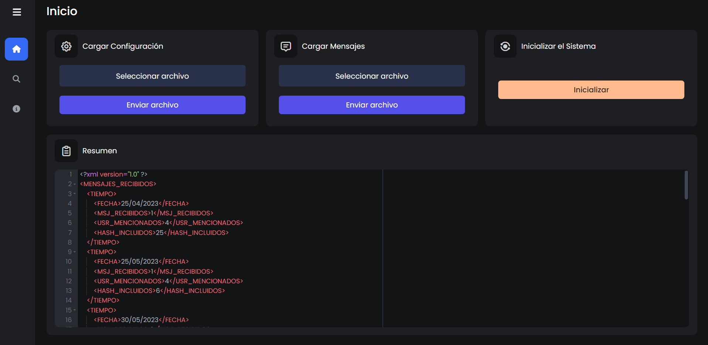

<h1 align="center">Proyecto 3</h1>
<p align="center">
    <a href="#"></a>
</p>
<p align="center">Programa de analisis de sentimientos sobre mensajes en redes sociales</p>

<div align="center">
🙍‍♂️ Joab Israel Ajsivinac Ajsivinac 🆔 202200135
</div>
<div align="center">
📕 Introducción a la Programación y Computación 2
</div>
<div align="center"> 🏛 Universidad San Carlos de Guatemala</div>
<div align="center"> 📆 Segundo Semestre 2023</div>

## 📋 Tabla de Contenidos

- [📋 Tabla de Contenidos](#-tabla-de-contenidos)
- [⚒ Requerimientos](#-requerimientos)
- [🗂 Recursos](#-recursos)
- [📟 Instalación](#-instalación)
- [⚡ Inicio Rápido](#-inicio-rápido)
- [💻 Interfaz de Usuario y Funcionalidades](#-interfaz-de-usuario-y-funcionalidades)
  - [Inicio](#inicio)
  - [Buscar](#buscar)
  - [Ayuda](#ayuda)
  - [Mensajes Emergentes](#mensajes-emergentes)
- [📖 Documentación](#-documentación)


<!-- Requerimientos -->

## ⚒ Requerimientos
<ul>
    <li>Sistemas Opreativos</li>
    <ul>
        <li>Windows 8 o Superior</li>
        <li>macOS Catalina o Superior</li>
        <li>Linux: Ubuntu, Debian, CentOS, Fedora, etc.</li>
    </ul>
    <li>Python 3.11.5 o Superior</li>
    <li>Librerías de Python</li>
    <ul>
    <li>Flask 3.0.0 o Superior</li>
    <li>Flask-Cors 4.0.0 o Superior</li>
    <li>Django 4.2.6  o Superior</li>
    <li>Requests 2.31.0 o Superior</li>
    <li>Unidecode 1.3.7 o Superior</li>
    </ul>
    <li>Fuentes</li>
    <ul>
        <li>Cascadia Code</li>
    </ul>
</ul>

## 🗂 Recursos
<ul>
  <li><a href="https://www.python.org/downloads/release/python-3115/">Python 3.11.5 o Superior</a></li>
  <li>Librerías de Python</li>
    <ul>
    <li><a href="https://pypi.org/project/Flask/">Flask 3.0.0 o Superior</a></li>
    <li><a href="https://pypi.org/project/Flask-Cors/">Flask-Cors 4.0.0 o Superior</a></li>
    <li><a href="https://pypi.org/project/Django/4.2.6/">Django 4.2.6  o Superior</a></li>
    <li><a href="https://pypi.org/project/requests/">Requests 2.31.0 o Superior</a></li>
    <li><a href="https://pypi.org/project/Unidecode/">Unidecode 1.3.7 o Superior</a></li>
    </ul>
    <li>Fuentes</li>
    <ul>
        <li><a href="https://github.com/microsoft/cascadia-code">Cascadia Code</a></li>
    </ul>
</ul>

## 📟 Instalación
Descargue el código o bien clone el repositorio en una carpeta.

Si se opta por la clonación se hace con la siguiente linea de código en terminal (Antes de ejecutar el codigo asegurese de estar en la carpeta donde lo quiere descargar)

```bash
git clone https://github.com/J-Ajsivinac/IPC2_Proyecto1_202200135.git
```

## ⚡ Inicio Rápido
Una vez se tenga descargado la aplicación, se tienen que ejecutar 2 servicios (El Backend y el Frontend).

El backend se ejecuta desde el cmd o consola, con el siguiente comando:

```bash
./run.sh
```

El Frontend se ejecuta desde el cmd o consola, con el siguiente comando:

```bash
./runf.sh
```

Una vez ejecutados los comandos puede abrir en el navegador la siguiente ruta

```
http://127.0.0.1:8000/
```

Si tiene una versión de python diferente, puede cambiar la versión en los archivos con extensión `.sh`

```bash
python3.11 app.py
```

Luego se ejecutará la aplicación, abriendo una ventana

## 💻 Interfaz de Usuario y Funcionalidades
Al ingresar a la ruta, se mostrará la siguiente pagina principal
<p align="center">
    
</p>

La aplicación se divide en 4 secciones, las cuales tienen una funcionalidad especifica.

### Inicio

En este apartado se tendrán los botones para cargar archivos de entrada (configuraciones y mensajes), inicializar el sistema, y poder ver el resumen luego de las cargas de archivos

> **Cargar Configuración**
> 
> Primero se debe elegir el archivo de configuración, dando click en seleccionar archivo, se abrirá una ventana para poder abrir el archivo correspondiente, para luego poder enviar el archivo, una vez enviado, se le mostrará un mensaje emergente indicando el resultado de la acción.

> **Cargar Mensajes**
> 
> Primero se debe elegir el archivo que contenga los mensajes ha analizar, dando click en seleccionar archivo, se abrirá una ventana para poder abrir el archivo correspondiente, para luego poder enviar el archivo, una vez enviado, se le mostrará un mensaje emergente indicando el resultado de la acción.

**Nota**: Existen archivos de prueba en la carpeta `input`, Se generarán archivos de resumenes, en una carpeta que se crea llamada resumenes.

> **Inicializar Sistema**
>
> Al presionar este botón se reiniciaran todas las varibles, incluyendo la carga de datos, y el procesado de datos, por lo que se perderá la información cargada en memoria, reiniciando la base de datos en el proceso.

Los resumenes, se verán de la siguiente manera:
<p align="center">
    
</p>

### Buscar
<p align="center">
    
</p>

En este apartado se podra hacer busquedas, bajo 3 criterios, por: Hashtags, Mensiones y Sentimientos, se eligen dando click en Buscar Por:

<p align="center">
    
</p>

A su vez, se puede elegir el rango de fechas en la cual se desea buscar, dando click en elija un rango: 

<p align="center">
    
</p>

Finalmente para completar la busqueda, se presiona Buscar, mostrando los resultados encontrados, si no hay información en el rango elegido, se mostrar un mensaje emergente indicandolo.

<p align="center">
    
</p>

Los resultados obtenidos, se podrán guardar en archivos `PDF`, presionando descargar

### Ayuda

En esta sección se podrá visualizar la información del creador de la aplicación, junto con un link para poder la documentación


### Mensajes Emergentes
El programa esta creado de forma que al momento de encontrar algún inconveniente, o completar una acción, se mostrará una ventana emergente en pantalla, teniendo 4 tipos de mensajes emergentes los cuales son:

**Opreación Exitosa**

Se muestra cuando se terminó un proceso, sirve para indicar que se completó una acción, mostrando un mensaje del tipo de acción completada 
<p align="center">
    
</p>

**Error**

Se muestra cuando se encontró un error, y sirve para indicar que tipo de error se encontro, mostrandolo en pantalla
<p align="center">
    
</p>

**Advertencia**

Se muestra cuando se encontró alguna inconsistencia, y sirve para indicar que tipo de inconsistencia se encontro, mostrandolo en pantalla
<p align="center">
    
</p>


## 📖 Documentación
Para comprender de mejor manera el funcionamiento del sistema puede, 
<a href="https://github.com/J-Ajsivinac/IPC2_Proyecto2_202200135/blob/main/Doc/Documentacion.pdf">Ver la documentación</a>